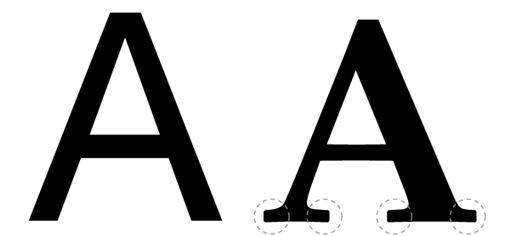

## 作业

## html元素 
  + block element (又名: 块元素):
  每个块级元素默认占一行高度,一行内添加一个块级元素后无法一般无法添加其他元素(float浮动后除外).两个块级元素连续编辑时,会在页面自动换行显示.
  
     + 常见块级元素:
     `div, h1-6, p, table, ol p ;`

  + inline element (又名: 内联元素,内嵌元素,行内元素) 
  行内元素在一行用水平顺序前后排列,超过父级元素的宽度的时候换行显示;
  
  + 特点: 
  设置宽,高,左右padding和左右margin无效(设置上下padding上下margin有效);
  
  + 常见行内元素:
   `a, img, span, i, input, select;`

## CSS语句

### 选择器
  + 基本选择器:
    - id选择器   		#idName
    - 类选择器   		.className
    - 元素选择器 		elementName
    - 通配符     		*
    - 属性选择器 		[attr=value]

  + 组合选择器
    - 后代选择器		  A B
    - 相邻兄弟选择器  A + B
    - 子选择器        A > B
    - 通用兄弟选择器  A ~ B    // 到chrome不兼容了23333

### 选择器优先级
讲过了,不讲
### 选择器效率 
 + 读取选择器原则是从右到左
 + 选择器效率排行
    1. ID选择器
    2. 类选择器
    3. 标签选择器
    4. 相邻选择器
    5. 子选择器
    6. 后代选择器
    7. 通配符选择器
    8. 属性选择器
    9. 伪类选择器

### 优化建议
 1. 避免使用通配符
 2. 不使用标签类名修饰id
 4. 不要使用标签名修饰类
 3. 关于后代选择器和子选择器：避免使用后代选择器,非要用的话建议用子选择器代替,但子选择器也要慎用,标签规则永远不要包含子选择器.
 4. 利用可继承性：没必要在一般内容上声明样式.

### 编码规范
  1. 每一条规则的大括号 { 前添加空格
  2. 多个selector共用一个样式集，则多个selector必须写成多行形式
  3. 每一条规则结束的大括号 } 必须与规则选择器的第一个字符对齐
  4. 属性名冒号之前不加空格，冒号之后加空格
  5. 属性值之后添加分号;
  6. 使用单引号，不允许使用双引号

## 命名和书写规范
  1. 规则命名中，一律采用小写加中划线的方式，不允许使用大写字母或 _
  2. 命名避免使用中文拼音，应该采用更简明有语义的英文单词进行组合
  3. 避免class与id重名
  4. id用于标识模块或页面的某一个父容器区域，名称必须唯一，不要随意新建id

### CSS书写顺序 
 + 显示属性:
    - displey
    - position3.
    - float
    - clear 
    - cursor

 + 盒模型
    - margin 
    - padding
    - width
    - height

 + 排版
    - vertical-align 
    - white-space
    - text-decoration
    - text-align

 + 文字
    - color
    - font
    - content
    - border 
    - background

## 盒模型

  - height width:
    内容区的宽高

  - margin:
  + margin-top-bottom-right-left
  + margin: 写法
  <!-- margin collapsing(外边距塌陷): 
    你以为它是bug吗?
    一个盒子如果没有上补白(padding-top)和上边框(border-top),那么这个盒子的上边距会和其内部文档流中的第一个子元素的上边距重叠.
    垂直外边距margin不叠加,谁大谁就是老大,而水平外边距叠加 -->

  - padding(内边距):
    写法同margin,没什么好说的

  - overflow:
    这个属性作用于block元素上, 属性作用于block型元素上.它规定了当内容元素溢出元素框时发生的事：裁剪内容,使用滚动条来显示 或 直接显示超出部分 .

    + visiable: 
      可见

    + hidden:
      隐藏

    + scroll
      内容会被修剪,浏览器会显示滚动条以便查看其余内容

    + auto
      由浏览器定夺,如果内容被修剪,就会显示滚动条
  + inherit
    从父元素继承overflow的值

    <!-- overflow 默认值(visible)以外的值将创建一个新的块级格式化上下文(BFC)这在技术层面上是必须的——如果一个浮动元素和滚动条相交,它会强制(重新)包围内容元素.这种行为(重新包围内容元素)会在每一次移动滚动条之后发生,会使得滚动体验变差(慢). -->

    + 顺便说一下text-overflow:
      这是一个与overflow对应的关于文字超出长度如何显示的属性
      text-overflow 属性用于决定溢出的内容以何种形式提醒用户.它可以直接剪切(clipped),也可以显示一个省略号),或者显示一个自定义的字符串. 
      
        * ellipsis: 
          超出文字用省略号显示
      
        * clip
          剪裁
      
        * string
          用自定义的文字提示用户内容超出了
          ** 草案,未实现 **

  - box-sizing:
   + box-sizing: 
     属性用来改变默认的 CSS 盒模型 对元素高宽的计算方式.这个属性  用于模拟那些非正确支持标准盒模型的浏览器的表现.

     * content-box: 
       默认值, 标准盒模型 width 与 height 只包括内容的宽和高.

     * border-box: 
       width 与 height 包括内边距与边框,不包括外边距.这是IE怪异模式(Quirks mode)使用的 盒模型.
  - box-shadow:
    box-shadow 以逗号分割列表来描述一个或多个阴影效果,可以用到几乎任何元素上. 如果元素同时设置了 border-radius ,阴影也会有圆角效果.

  - max-width:
    该属性用来给元素设置最大宽度值. 定义了max-width的元素会在达到max-width值之后避免进一步按照width属性设置变大.

  - min-width:
    该属性为给定元素设置最小宽度.元素可以比指定值窄,但是不能比指定元素宽,它可以阻止 width 属性的应用值小于 min-width 的值.

  ** max-width 会覆盖width设置, 但 min-width设置会覆盖 max-width. **

  - visibility:
    元素隐藏或者显示;

    + visiable: 
    元素可见(默认值)

    + hidden
    元素隐藏

    + ` display: none `和 ` visibility: hidden`  有什么区别

      `visibility: hidden`使元素不可见, 占有位置

      ` display: none ` 的元素不可见,也不占有位置

## border
  + border-radius:
    圆角边框

  + border 

## 定位
CSS有三种基本的定位机制：普通流、 浮动、绝对定位

### 普通流
顾名思义,普通流中的元素的位置由在HTML中的位置决定,根据上下级和前后的顺序,一个一个的排列在界面上;当然根据元素的类型不一样,排列的方式会不一样.

### 浮动
通过不同的命令使对象左右浮动,直到遇到border、padding、margin或其他对象边缘为止

 + 浮动造成的父元素高度塌陷

### 相对定位

### 定位上下文
position:absolute;的元素相对于祖先有positoin absolute或relative元素进行定位

### 绝对定位

### 固定定位

### BFC?

### 如何触发BFC
+ float的值不为none
+ overflow的值不为visible
+ display的值为inline-block、table-cell、table-caption
+ position的值为absolute或fixed

### BFC规则 
+ 内部的Box会在垂直方向上一个接一个的放置
+ 垂直方向上的距离由margin决定。（完整的说法是：属于同一个BFC的两个相邻Box的margin会发生重叠，与方向无关。）
+ 每个元素的左外边距与包含块的左边界相接触（从左向右），即使浮动元素也是如此。（这说明BFC中子元素不会超出他的包含块，而position为absolute的元素可以超出他的包含块边界）
+ BFC的区域不会与float的元素区域重叠
+ 计算BFC的高度时，浮动子元素也参与计算
+ BFC就是页面上的一个隔离的独立容器，容器里面的子元素不会影响到外面元素，反之亦然
##字体:

### 字体族
  + serif (衬线字体族):
    具有末端加粗、扩张或尖细末端,或以实际的衬线结尾的一类字体.
    栗子: 宋体
    
  + sans-serif (无衬线字体族):
  字体比较圆滑,线条粗线均匀,适合做艺术字、标题等,与“衬线字体”相比,如果字号比较小,看起来就会有些吃力.
  栗子: 隶书、楷体, 和`sublime`默认字体`Consolas`著名的微软雅黑,黑体
  
    
  + monospace (等宽字体族):
  一般字体不等宽,用了就等宽了,
  很多IDE和编辑器都是用的等宽字体
  栗子: `Courier`

  + cursive (手写字体族): 
    不说了,顾名思义
    栗子: 各种行书草书
  + fantasy (梦幻字体族) :
    主要用在图片中,字体看起来很艺术,实际网页上用得不多.(这句话翻译成大白话就是没卵用)
    栗子: `Symbol`

### 规则
CSS声明与选择器定义的相关联系

#### 声明
	xxx: xxxx;
#### 声明块
	selector {
		xxx: xxx;
	}

### @规则
@紧跟标示符;
具体写法根据标识符不同写法不同

栗子: @charset声明字符集"UTF-8"......

### @font-face
    @font-face {
      [font-family: <family-name>;]?
      [src: [ <uri> [format(<string>#)]? | <font-face-name> ]#;]?
    }

### iconfont
  + 什么是iconfont
  iconfont用字体文件取代图片文件,来展示图标,特殊字体等元素的方法
 
  + 怎么用?

## 切图步骤
1. 拿到视觉(姐姐)给的图
2. 把需要用到的图片用ps扣下来(PS傻瓜式抠图教程)
  + 选中图层
  + 转化成智能对象
  + 双击
  + 保存
3. 开始写html.css ..blablablabla其他的再说
